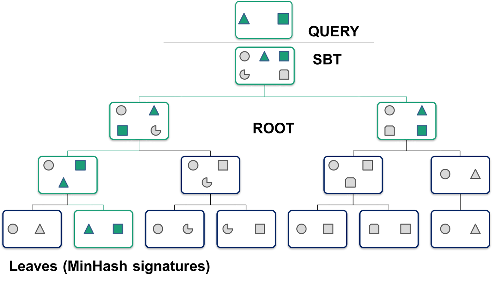
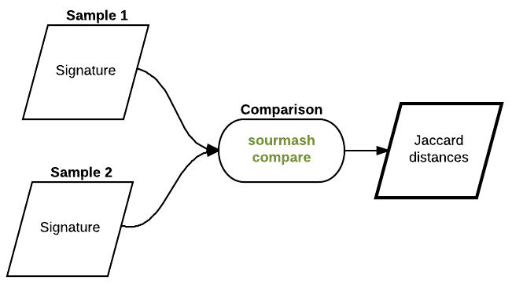
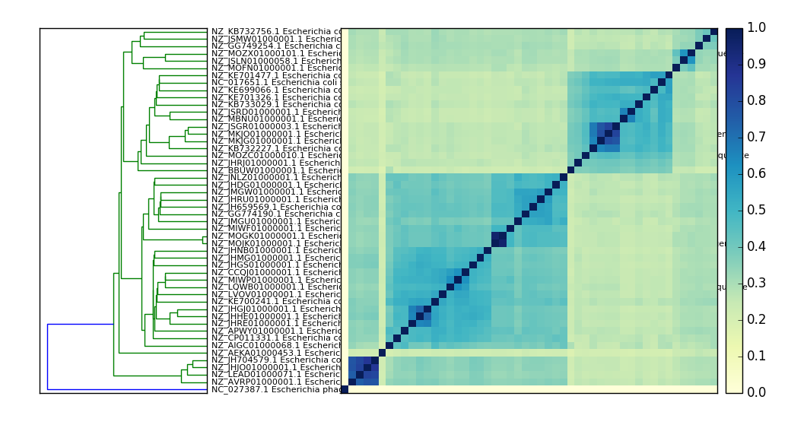
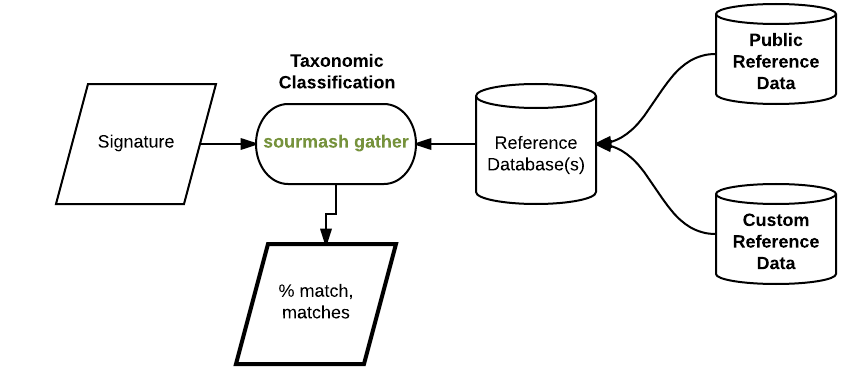

# A sourmash tutorial

[sourmash](http://sourmash.readthedocs.io/en/latest/) is our lab's
implementation of an ultra-fast lightweight approach to
nucleotide-level search and comparison, called MinHash.

You can read some background about MinHash sketches in this paper:
[Mash: fast genome and metagenome distance estimation using MinHash. Ondov BD, Treangen TJ, Melsted P, Mallonee AB, Bergman NH, Koren S, Phillippy AM. Genome Biol. 2016 Jun 20;17(1):132. doi: 10.1186/s13059-016-0997-x.](http://genomebiology.biomedcentral.com/articles/10.1186/s13059-016-0997-x)

## Objectives 
- Compare reads to assemblies 
- Create and search a custom database
- Compare datasets and build a tree 
- Determine what's in a metagenome (Taxonomic classification) 

## At the beginning

[Create / log into](jetstream/boot.html) an m1.medium Jetstream instance,
and run these two commands:

```
cd
curl -O https://s3-us-west-1.amazonaws.com/spacegraphcats.ucdavis.edu/microbe-genbank-sbt-k31-2017.05.09.tar.gz
tar xzf microbe-genbank-sbt-k31-2017.05.09.tar.gz
```
-- they take a long time :).

# K-mers, k-mer specificity, and comparing samples with k-mer Jaccard distance.

## K-mers!

K-mers are a fairly simple concept that turn out to be tremendously
powerful.

A "k-mer" is a word of DNA that is k long:

```
ATTG - a 4-mer
ATGGAC - a 6-mer
```

Typically we extract k-mers from genomic assemblies or read data sets by
running a k-length window across all of the reads and sequences -- e.g.
given a sequence of length 16, you could extract 11 k-mers of length six
from it like so:

```
AGGATGAGACAGATAG
```
becomes the following set of 6-mers:
```
AGGATG
 GGATGA
  GATGAG
   ATGAGA
    TGAGAC
     GAGACA
      AGACAG
       GACAGA
        ACAGAT
         CAGATA
          AGATAG
```

k-mers are most useful when they're *long*, because then they're *specific*.
That is, if you have a 31-mer taken from a human genome, it's pretty unlikely
that another genome has that exact 31-mer in it.  (You can calculate the
probability if you assume genomes are random: there are 4<sup>31</sup> possible
31-mers, and 4<sup>31</sup> = 4,611,686,018,427,387,904.  So, you know, a lot.)

The important concept here is that **long k-mers are species specific**.
We'll go into a bit more detail later.

## K-mers and assembly graphs

We've already run into k-mers before, as it turns out - when we were
doing [genome assembly](assemble.html).  One of the three major
ways that genome assembly works is by taking reads, breaking them into
k-mers, and then "walking" from one k-mer to the next to bridge between
reads.  To see how this works, let's take the 16-base sequence above,
and add another overlapping sequence:
    
```
AGGATGAGACAGATAG
    TGAGACAGATAGGATTGC
```

One way to assemble these together is to break them down into k-mers -- 

becomes the following set of 6-mers:
```
AGGATG
 GGATGA
  GATGAG
   ATGAGA
    TGAGAC
     GAGACA
      AGACAG
       GACAGA
        ACAGAT
         CAGATA
          AGATAG -> off the end of the first sequence
           GATAGG <- beginning of the second sequence
            ATAGGA
             TAGGAT
              AGGATT
               GGATTG
                GATTGC
```

and if you walk from one 6-mer to the next based on 5-mer overlap, you get
the assembled sequence:

```
AGGATGAGACAGATAGGATTGC
```

Graphs of many k-mers together are called De Bruijn graphs, and assemblers
like MEGAHIT and SOAPdenovo are De Bruijn graph assemblers - they use k-mers
underneath.

## Why k-mers, though? Why not just work with the full read sequences?

Computers *love* k-mers because there's no ambiguity in matching them.
You either have an exact match, or you don't.  And computers love that
sort of thing!

Basically, it's really easy for a computer to tell if two reads share a
k-mer, and it's pretty easy for a computer to store all the k-mers that
it sees in a pile of reads or in a genome.

## Long k-mers are species specific

So, we've said long k-mers (say, k=31 or longer) are pretty species specific.
Is that really true?

Yes! Check out this figure from the [MetaPalette paper](http://msystems.asm.org/content/1/3/e00020-16):

.. thumbnail:: ./_static/kmers-metapalette.png

here, the Koslicki and Falush show that k-mer similarity works to
group microbes by genus, at k=40. If you go longer (say k=50) then
you get only very little similarity between different species.

## Using k-mers to compare samples against each other

So, one thing you can do is use k-mers to compare genomes to genomes,
or read data sets to read data sets: data sets that have a lot of similarity
probably are similar or even the same genome.

One metric you can use for this comparisons is the Jaccard distance, which
is calculated by asking how many k-mers are *shared* between two samples
vs how many k-mers in total are in the combined samples.

```
only k-mers in both samples
----------------------------
all k-mers in either or both samples
```

A Jaccard distance of 1 means the samples are identical; a Jaccard distance
of 0 means the samples are completely different.

This is a great measure and it can be used to search databases and 
cluster unknown genomes and all sorts of other things!  The only real
problem with it is that there are a *lot* of k-mers in a genome --
a 5 Mbp genome (like *E. coli*) has 5 m k-mers!

About a year ago,
[Ondov et al. (2016)](https://genomebiology.biomedcentral.com/articles/10.1186/s13059-016-0997-x)
showed that
[MinHash approaches](https://en.wikipedia.org/wiki/MinHash) could be
used to estimate Jaccard distance using only a small fraction (1 in
10,000 or so) of all the k-mers.

The basic idea behind MinHash is that you pick a small subset of k-mers
to look at, and you use those as a proxy for *all* the k-mers.  The trick
is that you pick the k-mers randomly but consistently: so if a chosen
k-mer is present in two data sets of interest, it will be picked in both.
This is done using a clever trick that we can try to explain to you in
class - but either way, trust us, it works!

We have implemented a MinHash approach in our
[sourmash software](https://github.com/dib-lab/sourmash/), which can
do some nice things with samples.  We'll show you some of these things
next!

## Installing sourmash

To install sourmash, run:

```
sudo apt-get -y update && \
sudo apt-get install -y python3.5-dev python3.5-venv make \
    libc6-dev g++ zlib1g-dev
```

this installs Python 3.5.

Now, create a local software install and populate it with Jupyter and
other dependencies:

```

python3.5 -m venv ~/py3
. ~/py3/bin/activate
pip install -U pip
pip install -U Cython
pip install -U jupyter jupyter_client ipython pandas matplotlib scipy scikit-learn khmer

pip install -U https://github.com/dib-lab/sourmash/archive/master.zip

```

## Generate a signature for Illumina reads

Download some reads and a reference genome:

```
mkdir ~/data
cd ~/data
wget http://public.ged.msu.edu.s3.amazonaws.com/ecoli_ref-5m-trim.pe.fq.gz
wget https://s3.amazonaws.com/public.ged.msu.edu/ecoliMG1655.fa.gz
```

Compute a scaled MinHash signature from our reads:


```
mkdir ~/sourmash
cd ~/sourmash

sourmash compute --scaled 10000 ~/data/ecoli_ref*pe*.fq.gz -o ecoli-reads.sig -k 31
```

## Compare reads to assemblies

Use case: how much of the read content is contained in the reference genome?

Build a signature for an *E. coli* genome:

```
sourmash compute --scaled 10000 -k 31 ~/data/ecoliMG1655.fa.gz -o ecoli-genome.sig
```

and now evaluate *containment*, that is, what fraction of the read content is
contained in the genome:


```
sourmash search -k 31 ecoli-reads.sig ecoli-genome.sig --containment
```

and you should see:

```
# running sourmash subcommand: search
loaded query: /home/ubuntu/data/ecoli_ref-5m... (k=31, DNA)
loaded 1 signatures from ecoli-genome.sig
1 matches:
similarity   match
----------   -----
 46.6%       /home/ubuntu/data/ecoliMG1655.fa.gz
```

Why are only 50% or so of our k-mers from the reads in the genome!?
Any ideas?

Try the reverse - why is it bigger?
         
```
sourmash search -k 31 ecoli-genome.sig ecoli-reads.sig --containment
```

(...but 99% of our k-mers from the genome are in the reads!?)

This is basically because of sequencing error! Illumina data contains
a lot of errors, and the assembler doesn't include them in the assembly!

## Make and search a database quickly.

Suppose that we have a collection of signatures (made with `sourmash
compute` as above) and we want to search it with our newly assembled
genome (or the reads, even!). How would we do that?

Let's grab a sample collection of 50 E. coli genomes and unpack it --

```
mkdir ecoli_many_sigs
cd ecoli_many_sigs

curl -O -L https://github.com/dib-lab/sourmash/raw/master/data/eschericia-sigs.tar.gz

tar xzf eschericia-sigs.tar.gz
rm eschericia-sigs.tar.gz

cd ../

```

This will produce 50 files named `ecoli-N.sig` in the `ecoli_many_sigs` --

```
ls ecoli_many_sigs
```

Let's turn this into an easily-searchable database with `sourmash index` --

```
sourmash index -k 31 ecolidb ecoli_many_sigs/*.sig
```
What does the database look like and how does the search work?



sourmash search (and gather) compare the query and the database (sequence bloom tree) 
and report matches based containment.  

One point to make with this is that the search can quickly narrow down
which signatures match your query, without losing any matches.  It's a
clever example of how computer scientists can actually make life
better :).

----

And now we can search!

```
sourmash search ecoli-genome.sig ecolidb.sbt.json -n 20
```

You should see output like this:

```
# running sourmash subcommand: search
select query k=31 automatically.
loaded query: /home/tx160085/data/ecoliMG165... (k=31, DNA)
loaded SBT ecolidb.sbt.json
Searching SBT ecolidb.sbt.json
49 matches; showing first 20:
similarity   match
----------   -----
 75.4%       NZ_JMGW01000001.1 Escherichia coli 1-176-05_S4_C2 e117605...
 72.2%       NZ_GG774190.1 Escherichia coli MS 196-1 Scfld2538, whole ...
 71.4%       NZ_JMGU01000001.1 Escherichia coli 2-011-08_S3_C2 e201108...
 70.1%       NZ_JHRU01000001.1 Escherichia coli strain 100854 100854_1...
 69.0%       NZ_JH659569.1 Escherichia coli M919 supercont2.1, whole g...
 64.9%       NZ_JNLZ01000001.1 Escherichia coli 3-105-05_S1_C1 e310505...
 63.0%       NZ_MOJK01000001.1 Escherichia coli strain 469 Cleandata-B...
 62.9%       NZ_MOGK01000001.1 Escherichia coli strain 676 BN4_676_1_(...
 62.0%       NZ_JHDG01000001.1 Escherichia coli 1-176-05_S3_C1 e117605...
 59.9%       NZ_MIWF01000001.1 Escherichia coli strain AF7759-1 contig...
 52.7%       NZ_KE700241.1 Escherichia coli HVH 147 (4-5893887) acYxy-...
 51.7%       NZ_APWY01000001.1 Escherichia coli 178200 gec178200.conti...
 49.3%       NZ_LVOV01000001.1 Escherichia coli strain swine72 swine72...
 49.3%       NZ_MIWP01000001.1 Escherichia coli strain K6412 contig_00...
 49.0%       NZ_LQWB01000001.1 Escherichia coli strain GN03624 GCID_EC...
 48.9%       NZ_JHGJ01000001.1 Escherichia coli O45:H2 str. 2009C-4780...
 48.1%       NZ_CP011331.1 Escherichia coli O104:H4 str. C227-11, comp...
 47.7%       NZ_JHNB01000001.1 Escherichia coli O103:H25 str. 2010C-45...
 47.7%       NZ_JHRE01000001.1 Escherichia coli strain 302014 302014_1...
 47.6%       NZ_JHHE01000001.1 Escherichia coli O103:H2 str. 2009C-327...

```

identifying what genome is in the signature.

## Compare many signatures and build a tree.

Adjust plotting (this is a bug in sourmash :) --
```
echo 'backend : Agg' > matplotlibrc
```

Compare all the signatures:



```
sourmash compare ecoli_many_sigs/* -o ecoli_cmp
```

and then plot:

```
sourmash plot --labels ecoli_cmp
```

which will produce a file `ecoli_cmp.matrix.png` and `ecoli_cmp.dendro.png`
which you can then download via FileZilla and view on your local computer.

Now open jupyter notebook and visualize: 

```
from IPython.display import Image
Image("ecoli_cmp.matrix.png")
```

Here's a PNG version:



## What's in my metagenome?

At the beginning, we downloaded and unpacked a GenBank index of all
the microbial genomes -- you can see a basic description here,
[CTB's blog post](http://ivory.idyll.org/blog/2016-sourmash-sbt-more.html)
-- this one contains sketches of all 100k Genbank microbes. (See
[available sourmash databases](http://sourmash.rtfd.io/en/latest/databases.html)
for more information.)

After this database is unpacked, it produces a file
`genbank-k31.sbt.json` and a whole bunch of hidden files in the
directory `.sbt.genbank-k31`.

Next, run the 'gather' command to see what's in your ecoli genome --



at the command line run: 

```
sourmash gather -k 31 ecoli-reads.sig ../genbank-k31.sbt.json -o ecoli-reads-gather-reults.csv
```

and you should get:

```
# running sourmash subcommand: sbt_gather
loaded query: /home/tx160085/data/ecoli_ref-... (k=31, DNA)
loaded SBT ../genbank-k31.sbt.json

overlap     p_query p_match
---------   ------- --------
4.9 Mbp      46.6%  100.0%      APIN01000001.1 Escherichia coli str. ...
3.4 Mbp      32.4%    1.5%      AQAX01000001.1 Escherichia coli P0304...
2.5 Mbp      23.6%    0.7%      JHDK01000001.1 Escherichia coli 1-110...
160.0 kbp     1.5%    0.6%      AMPE01000001.1 Citrobacter sp. L17 co...
0.5 Mbp       4.8%    0.4%      BBVS01000001.1 Escherichia albertii D...
3.3 Mbp      31.2%    0.4%      APYP01000001.1 Escherichia coli P0299...
3.6 Mbp      34.5%    0.4%      AQCO01000001.1 Escherichia coli MP021...
4.3 Mbp      40.9%    0.4%      JONB01000001.1 Escherichia coli 3-020...
2.8 Mbp      26.0%    0.5%      AZPL01000001.1 Shigella flexneri 2001...
2.8 Mbp      26.0%    0.2%      MIIY01000001.1 Shigella sp. FC1737 NO...
2.2 Mbp      20.7%    0.2%      AFET01000004.1 Escherichia coli AA86 ...
found less than 10.0 kbp in common. => exiting

found 11 matches total;
the recovered matches hit 49.2% of the query
```

You can use this on metagenomes (assembled and
unassembled) as well; you've just got to make the signature files.

To see this in action, here is gather running on a signature generated
from some sequences that assemble (but don't align to known genomes)
from the
[Shakya et al. 2013 mock metagenome paper](https://www.ncbi.nlm.nih.gov/pubmed/23387867).

```
wget https://github.com/dib-lab/sourmash/raw/master/doc/_static/shakya-unaligned-contigs.sig
sourmash gather -k 31 shakya-unaligned-contigs.sig ../genbank-k31.sbt.json
```

This should yield:
```
# running sourmash subcommand: gather
loaded query: mqc500.QC.AMBIGUOUS.99.unalign... (k=31, DNA)
loaded SBT genbank-k31.sbt.json

overlap     p_query p_match
---------   ------- --------
1.4 Mbp      11.0%   58.0%      JANA01000001.1 Fusobacterium sp. OBRC1 c
1.0 Mbp       7.7%   25.9%      CP001957.1 Haloferax volcanii DS2 plasmi
0.9 Mbp       7.5%   11.8%      BA000019.2 Nostoc sp. PCC 7120 DNA, comp
0.7 Mbp       5.9%   23.0%      FOVK01000036.1 Proteiniclasticum ruminis
0.7 Mbp       5.3%   17.6%      AE017285.1 Desulfovibrio vulgaris subsp.
0.6 Mbp       4.9%   11.1%      CP001252.1 Shewanella baltica OS223, com
0.6 Mbp       4.8%   27.3%      AP008226.1 Thermus thermophilus HB8 geno
0.6 Mbp       4.4%   11.2%      CP000031.2 Ruegeria pomeroyi DSS-3, comp
480.0 kbp     3.8%    7.6%      CP000875.1 Herpetosiphon aurantiacus DSM
410.0 kbp     3.3%   10.5%      CH959317.1 Sulfitobacter sp. NAS-14.1 sc
1.4 Mbp      10.9%   11.8%      LN831027.1 Fusobacterium nucleatum subsp
0.5 Mbp       4.1%    5.3%      CP000753.1 Shewanella baltica OS185, com
420.0 kbp     3.3%    7.7%      FNDZ01000023.1 Proteiniclasticum ruminis
150.0 kbp     1.2%    4.5%      CP015081.1 Deinococcus radiodurans R1 ch
150.0 kbp     1.2%    8.2%      CP000969.1 Thermotoga sp. RQ2, complete
290.0 kbp     2.3%    4.1%      CH959311.1 Sulfitobacter sp. EE-36 scf_1
1.2 Mbp       9.4%    5.0%      CP013328.1 Fusobacterium nucleatum subsp
110.0 kbp     0.9%    3.5%      FREL01000833.1 Enterococcus faecalis iso
0.6 Mbp       5.0%    2.8%      CP000527.1 Desulfovibrio vulgaris DP4, c
340.0 kbp     2.7%    3.3%      KQ235732.1 Fusobacterium nucleatum subsp
70.0 kbp      0.6%    1.2%      CP000850.1 Salinispora arenicola CNS-205
60.0 kbp      0.5%    0.7%      CP000270.1 Burkholderia xenovorans LB400
50.0 kbp      0.4%    2.6%      CP001080.1 Sulfurihydrogenibium sp. YO3A
50.0 kbp      0.4%    3.2%      L77117.1 Methanocaldococcus jannaschii D
found less than 40.0 kbp in common. => exiting

found 24 matches total;
the recovered matches hit 73.4% of the query

```

In our
[recent preprint](biorxiv.org/content/biorxiv/early/2017/06/25/155358.full.pdf)
using this, we showed that 

It is straightforward to build your own databases for use with
`search` and `gather`; this is of interest if you have dozens or
hundreds of sequencing data sets in your group. Ping us if you want us
to write that up.

## Final thoughts on sourmash

There are many tools like Kraken and Kaiju that can do taxonomic
classification of individual reads from metagenomes; these seem to
perform well (albeit with high false positive rates) in situations
where you don't necessarily have the genome sequences that are in the
metagenome.  Sourmash, by contrast, can estimate which known genomes are
actually present, so that you can extract them and map/align to them.
It seems to have a very low false positive rate and is quite sensitive
to strains.

Above, we've shown you a few things that you can use sourmash for.  Here
is a (non-exclusive) list of other uses that we've been thinking about --

* detect contamination in sequencing data;

* index and search private sequencing collections;

* search all of SRA for overlaps in metagenomes;

Chat with Luiz, Phil, or Titus if you are interested in these use cases!
